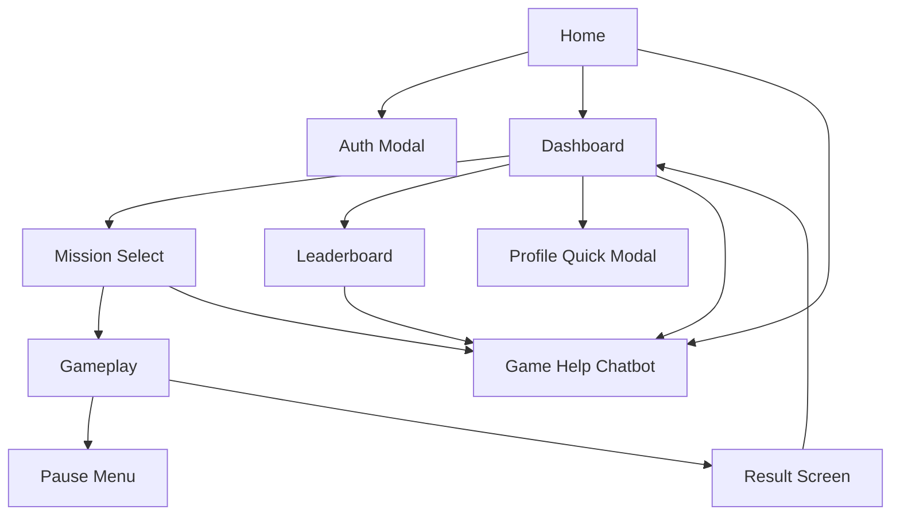

# Stellar Smash

Stellar Smash is a 3D browser space-survival game built with React, Three.js, GraphQL, and MongoDB. Players steer with the mouse, fire into a collapsing tunnel, survive mission waves, and track long-term progress through dashboard stats, achievements, and an overall leaderboard.

The site now also includes a Groq-powered help chatbot in the bottom-right corner. It answers Stellar Smash gameplay and navigation questions and stays hidden during active gameplay and pause state so it does not interfere with the HUD.

## Tech Stack

### Frontend
- React
- Vite
- React Router
- Apollo Client
- Zustand
- Three.js
- React Three Fiber
- React Three Drei

### Backend
- Node.js
- Express
- Apollo Server
- GraphQL
- graphql-ws
- MongoDB
- Mongoose
- JWT authentication
- Groq Chat Completions API through the backend

## Local Setup

### Prerequisites
- Node.js 18 or newer
- MongoDB running locally or through Atlas

### Backend
1. Open a terminal in `/server`.
2. Install dependencies:

```bash
npm install
```

3. Create `server/.env`:

```env
PORT=4000
MONGODB_URI=mongodb://localhost:27017/stellar-smash
JWT_SECRET=your_jwt_secret_here
JWT_EXPIRES_IN=7d
CLIENT_URL=http://localhost:5173
GROQ_API_KEY=your_groq_api_key_here
```

4. Start the backend:

```bash
npm run dev
```

### Frontend
1. Open a second terminal in `/client`.
2. Install dependencies:

```bash
npm install
```

3. Optional client env overrides:

```env
VITE_GRAPHQL_HTTP_URL=http://localhost:4000/graphql
VITE_GRAPHQL_WS_URL=ws://localhost:4000/graphql
```

4. Start the frontend:

```bash
npm run dev
```

## Pages and Navigation

- `/` Home page with game overview and auth modal entry points
- `/game` Mission Select, active gameplay, pause state, and result screen
- `/dashboard` Career stats, mission records, mission progress, and achievements
- `/leaderboard` Overall score ranking across all players
- Profile and account settings open from the top-right level and avatar control in the navbar

## How to Play

1. Open `Play` and choose a mission.
2. Move the mouse to aim and steer the ship.
3. Hold click to fire.
4. Press `Escape` to pause and open the pause menu.
5. Protect the ship forcefield until the mission timer expires.

### Mission Overview
- Level 1: `The Minefield` with meteors and mines
- Level 2: `Specter Run` with Ghost Boy, King Boo, and mines
- Level 3: `The Absurd Threat` with Chuck, the Red Angrybird boss, and mines

### Score Rules
- Meteor: `+10`
- Ghost Boy: `+20`
- King Boo: `+30`
- Chuck: `+50`
- Red Angrybird boss: `+100`
- Mine: `-15` and combo reset when shot

### Weapon Rules
- Level 1 fires one shot at a time
- Levels 2 and 3 fire a short two-shot burst
- Boss targets can require multiple hits depending on their health

## Progression

- XP comes from mission runs and claimed achievements
- Levels increase automatically when XP crosses the required threshold
- Dashboard shows career stats, mission records, mission progress, and achievements
- Leaderboard ranks players by overall score, not separate per-level scoreboards
- Saving results writes the run into the player profile and updates best mission progress when the run is better

## Chatbot

- The help chatbot appears in the bottom-right corner across the site
- It is available to guests and signed-in users
- It is hidden during active gameplay and while the pause menu is open
- It answers only Stellar Smash site and gameplay questions
- The Groq key is stored on the backend only through `GROQ_API_KEY`
- The server currently uses the Groq model `llama-3.3-70b-versatile` as a fixed backend default
- If the backend does not have a Groq key yet, the chatbot fails gracefully with a friendly message

## Workflow

1. Start MongoDB
2. Start the backend server
3. Start the frontend dev server
4. Open the site in the browser
5. Sign in or create an account
6. Launch a mission, save results, and review progress on the dashboard and leaderboard

## High-Level Flow


